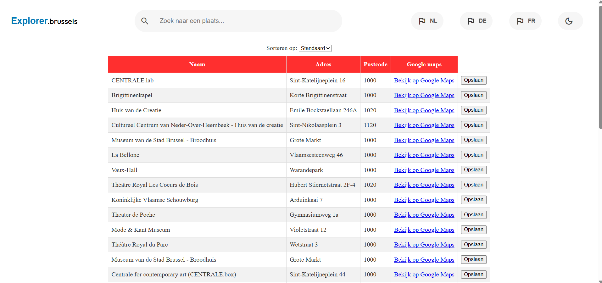
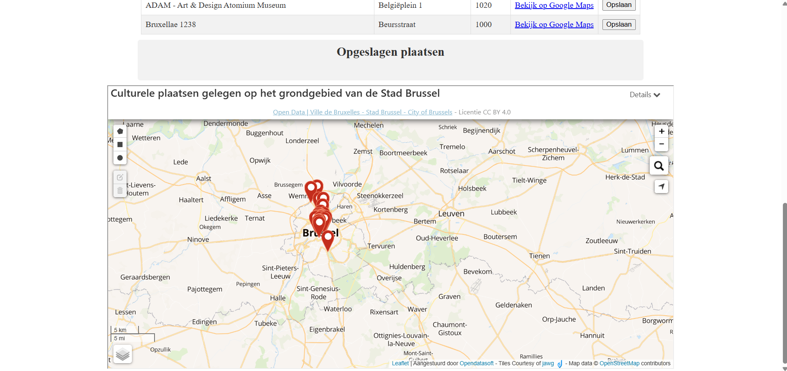
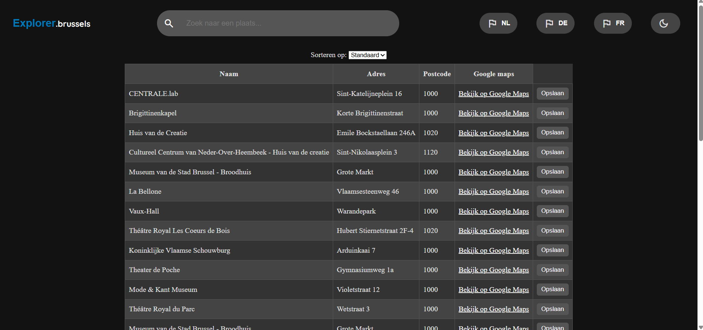

# dynamicWeb_project
 
Explorer.Brussels is een applicatie die toeristen begeleidt en hen verwijst naar verschillende culturele plekken in Brussel. Dit gebeurt aan de hand van een overzicht met adressen en locaties. 

Deze applicatie heeft meerdere functionaliteiten zoals: 
-De gebruiker kan locaties opslaan
-De gebruiker kan de locaties op een kaart zien
-De gebruiker kan zoeken naar specifieke plaatsnamen
-De gebruiker kan sorteren op plaatsnaam, adres, of postcode
-De gebruiker heeft een optie om de locatie op Google maps te openen om meer info te verkrijgen
-De gebruiker kan wisselen tussen een licht en donker thema op de site

Voor de data op de site hebben we gebruik gemaakt van de volgende api:
https://bruxellesdata.opendatasoft.com/explore/dataset/bruxelles_lieux_culturels/information/?location=11,50.89089,4.38411&basemap=jawg.sunny

technische vereisten:
Elementen selecteren -> lijn 22
Elementen manipuleren -> lijn 45
Events aan elementen koppelen -> lijn 78
Gebruik van constanten -> lijn 5
Template literals -> lijn 36-42
Iteratie over arrays -> lijn 32
Array methodes -> lijn 84
Arrow functions -> lijn 32
Conditional (ternary) operator (moderne if..else) -> lijn 37
Promises -> lijn 5
Async & Await -> lijn 3
Fetch om data op te halen -> lijn 5
JSON manipuleren en weergeven -> lijn 11

Taakverdeling:
Tyvian
-Planning maken
-Mission statement schrijven
-User story's schrijven
-backlog bijouden
-ontwerp maken
-maken/ontwerpen navigatiebalk
-voor opmaak van de webpagina zorgen
Tim
-verbinding met api maken
-data uit api in tabel weergeven
-javascript functies schrijven voor alle nodige functionaliteiten

Screenshots:

Bronnen:
https://www.w3schools.com/css/css_table.asp
https://www.w3schools.com/js/js_api_fetch.asp
https://developer.mozilla.org/en-US/docs/Web/API/Fetch_API/Using_Fetch
https://chatgpt.com/